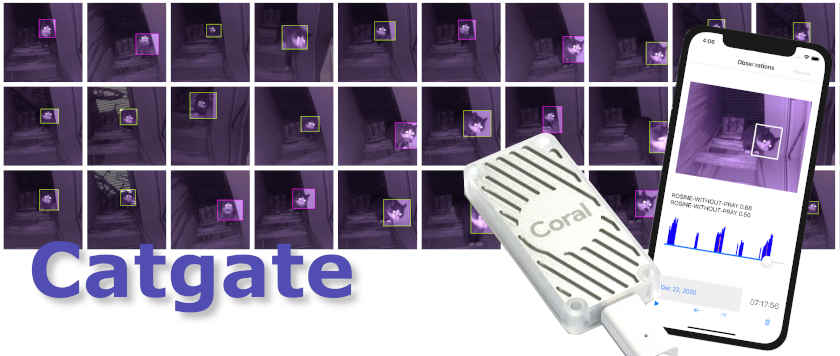
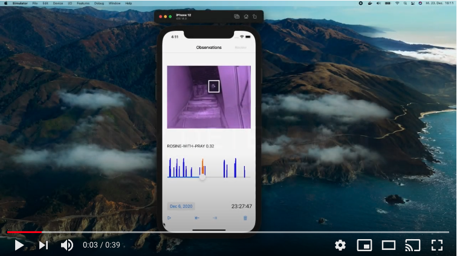

[](https://creativecommons.org/licenses/by-nc/4.0/)

Keep your cat’s prey out of your home with a machine learning trained pet door.
Turn your Sureflap cat flap into a smart flap that locks when you cat tries to take pray into your home.
Leverage Google Coral Edge TPU to run millisecond inference on infrared images captured on your Raspberry Pi. Object detection is based on TFLite and a MobileNet v1 SSD.

[](https://www.youtube.com/watch?v=ubhCDndjdUk)


## Required hardware:

* [Sureflap](https://amzn.to/3mB8hc0) or [Sureflap Connect](https://amzn.to/3aFExbP)
* [Raspberry Pi 4B](https://amzn.to/2KiHtAl)
* [Raspberry USB Power supply](https://amzn.to/2LRrMAk)
* [Case for Raspberry](https://amzn.to/3nHltxb)
* [MicroSD Card](https://amzn.to/37IbhPM)
* [Google Coral](https://amzn.to/3aB5o8S)
* [Infrared camera](https://amzn.to/38tSWF4)
* [Camera cable](https://amzn.to/3mGkagM)
* [Jumper cables](https://amzn.to/3rkcYue)
* [Motion detector](https://amzn.to/3aB6nWC)
* [Relay](https://amzn.to/38oLVpe)

## Setup:

Clone this repo on your raspberry and run:

```bash
echo "deb https://packages.cloud.google.com/apt coral-edgetpu-stable main" | sudo tee /etc/apt/sources.list.d/coral-edgetpu.list
curl https://packages.cloud.google.com/apt/doc/apt-key.gpg | sudo apt-key add -
sudo apt-get update
sudo apt-get install libedgetpu1-std
pip3 install awscli --upgrade --user
aws configure
cp config.yaml ~/.config/mousehunter-edge/config.yaml
```

Connect motion detector OUT to GPIO8, check `pinout` to see your layout.

```
                                3V3  (1) (2)  5V         <--- motion detector VCC
                              GPIO2  (3) (4)  5V         <--- + port of relay
                              GPIO3  (5) (6)  GND        <--- motion detector GND
                              GPIO4  (7) (8)  GPIO14
                                GND  (9) (10) GPIO15
                              GPIO17 (11) (12) GPIO18
                              GPIO27 (13) (14) GND
                              GPIO22 (15) (16) GPIO23
                                 3V3 (17) (18) GPIO24
                              GPIO10 (19) (20) GND
                               GPIO9 (21) (22) GPIO25
                              GPIO11 (23) (24) GPIO8      <--- motion detector OUT
                                 GND (25) (26) GPIO7
                               GPIO0 (27) (28) GPIO1
                               GPIO5 (29) (30) GND
                               GPIO6 (31) (32) GPIO12
                              GPIO13 (33) (34) GND
                              GPIO19 (35) (36) GPIO16
     s-port of relay --->     GPIO26 (37) (38) GPIO20
     - port of relay --->        GND (39) (40) GPIO21
```


Configure  `~/.config/mousehunter-edge/config.yaml` with your AWS bucket name and ensure that aws credentials can read the objects in it.
Keep APNToken and certfile empty if you do not have it.
``` yaml
bucket: <your AWS S3 bucket>
curfewTime: 15
APNToken: <your Apple Push Notification Service (APNs) Token>
alertThreshold: 2.0
certfile: <your Apple certificate for APN for APN usage> 
```

Update `WorkingDirectory` values for both .service files.

```bash
sudo systemctl enable mausjaeger.service
sudo systemctl enable imagewatcher.service
sudo systemctl start mausjaeger.service
sudo systemctl start imagewatcher.service
```

## Retrain your own object detection model:

label you data with labelImg:
https://github.com/tzutalin/labelImg

Convert your labeled data to the TFRecord file format, e.g. with https://roboflow.com

Follow the coral.ai tuturials part "Set up the Docker container" on a machine with strong CPU. No GPU is required.
https://coral.ai/docs/edgetpu/retrain-detection/#set-up-the-docker-container

Copy your TFRecords to docker/object_detection/data

Configure train_input_reader, eval_input_reader and model.ssd.num_classes  the training pipeline:
```
docker/object_detection/out/ckpt/pipeline.config
```
Remove all lines following "PREPARING dataset" and execute the script:
```
docker/object_detection/scripts/prepare_checkpoint_and_dataset.sh
```

Contine to follow the coral.ai tutorial part "Start training" and "Compile the model for the Edge TPU"
Copy the created model to the imagewatcher/model/ folder.


